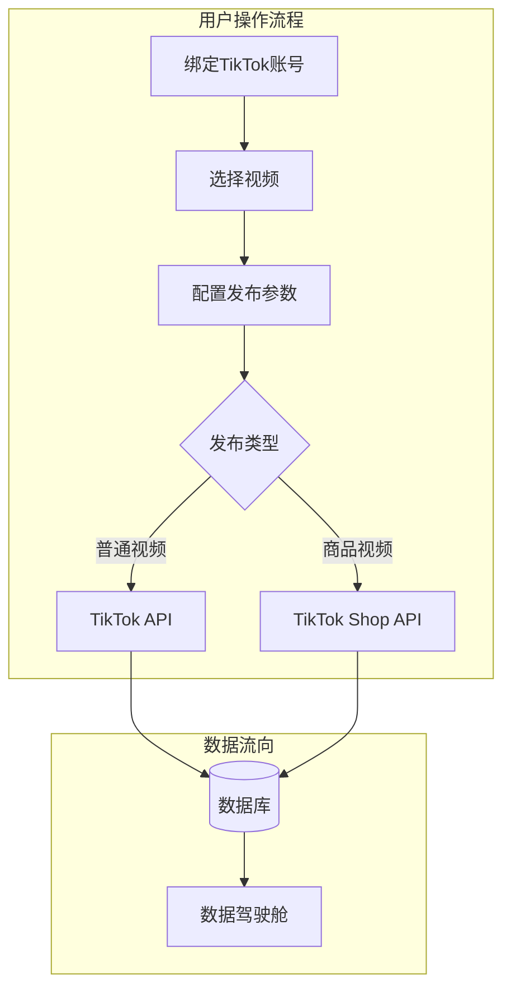
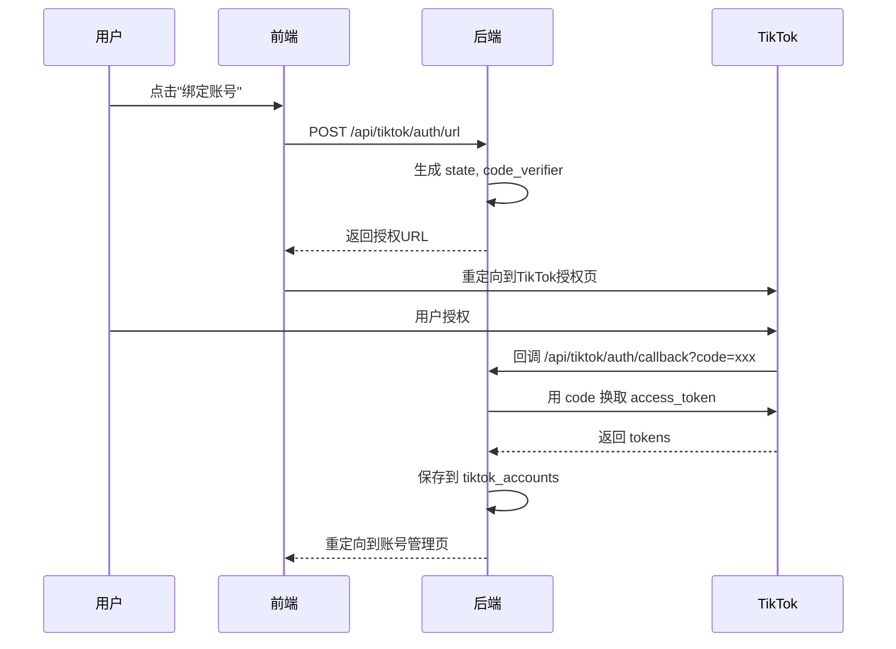

# TikTok 视频发布功能架构规划 v2

> 创建日期：2026-01-15
> 状态：待开发

## 一、核心需求梳理

| 需求 | 优先级 | 说明 |
|------|--------|------|
| 发布功能 | P0 | 单条发布 + 批量发布，支持定时 |
| 数据统计 | P1 | 整合到现有数据驾驶舱 |
| 账号管理 | P1 | TikTok OAuth 授权绑定 |
| 互动管理 | P2 | 预留，后期开发 |

**双轨制设计**：
- **普通视频发布**：对接 TikTok for Developers API（现在可做）
- **商品视频发布**：对接 TikTok Shop API（预留接口，待权限）

---

## 二、系统架构



---

## 三、侧边栏结构

更新"矩阵发货"分组，简化为 3 个核心入口：

```
矩阵发货
├── 智能分发站    → /publish          (核心：发布功能)
├── 账号管理      → /publish/accounts  (绑定TikTok账号)
└── 互动管理台    → /publish/interact  (Coming Soon)
```

**设计说明**：
- 「发布记录」不单独做入口，整合到「智能分发站」页面内用 Tab 切换
- 「互动管理」标记为即将推出

---

## 四、页面设计

### 4.1 智能分发站 `/publish` (核心页面)

采用 **Tab 切换** 设计，一个页面包含：创建发布 + 发布记录

```
┌─────────────────────────────────────────────────────────────────────┐
│  智能分发站                                                          │
├─────────────────────────────────────────────────────────────────────┤
│  [创建发布]  [发布记录]  [定时队列]                    ← Tab 切换     │
├─────────────────────────────────────────────────────────────────────┤
│                                                                     │
│  ═══════════════════════════════════════════════════════════════   │
│  │ 发布类型                                                      │  │
│  ═══════════════════════════════════════════════════════════════   │
│  │ ● 普通视频    ○ 商品视频 (即将推出)                           │  │
│  ───────────────────────────────────────────────────────────────   │
│                                                                     │
│  ═══════════════════════════════════════════════════════════════   │
│  │ Step 1: 选择视频                                              │  │
│  ═══════════════════════════════════════════════════════════════   │
│  │ [从成品库选择]  [本地上传]  [输入视频URL]                     │  │
│  │                                                               │  │
│  │ ┌─────┐ ┌─────┐ ┌─────┐ ┌─────┐                              │  │
│  │ │ ▶️  │ │ ▶️  │ │ ▶️  │ │ + │ ← 添加更多                     │  │
│  │ └─────┘ └─────┘ └─────┘ └─────┘                              │  │
│  │ 已选择 3 个视频                                               │  │
│  ───────────────────────────────────────────────────────────────   │
│                                                                     │
│  ═══════════════════════════════════════════════════════════════   │
│  │ Step 2: 选择发布账号                                          │  │
│  ═══════════════════════════════════════════════════════════════   │
│  │ ☑ @creator1  粉丝 12.5K  ✅ 已授权                            │  │
│  │ ☑ @creator2  粉丝 8.2K   ✅ 已授权                            │  │
│  │ ☐ @creator3  粉丝 5.1K   ⚠️ 需重新授权                        │  │
│  │                                    [+ 绑定新账号]              │  │
│  ───────────────────────────────────────────────────────────────   │
│                                                                     │
│  ═══════════════════════════════════════════════════════════════   │
│  │ Step 3: 发布设置                                              │  │
│  ═══════════════════════════════════════════════════════════════   │
│  │ 视频描述: [____________________] 支持变量 {n} {date}          │  │
│  │                                                               │  │
│  │ 隐私设置: ● 公开  ○ 好友可见  ○ 仅自己                        │  │
│  │ 互动设置: ☑ 允许评论  ☑ 允许合拍  ☑ 允许拼接                 │  │
│  │ 内容声明: ☐ 品牌推广  ☐ AI生成内容                           │  │
│  ───────────────────────────────────────────────────────────────   │
│                                                                     │
│  ═══════════════════════════════════════════════════════════════   │
│  │ Step 4: 发布时间                                              │  │
│  ═══════════════════════════════════════════════════════════════   │
│  │ ● 立即发布                                                    │  │
│  │ ○ 定时发布  [2026-01-16]  [09:00]                            │  │
│  │                                                               │  │
│  │ 批量间隔: [5] 分钟  (多视频时，间隔发布避免限流)               │  │
│  ───────────────────────────────────────────────────────────────   │
│                                                                     │
│  ┌─────────────────────────────────────────────────────────────┐   │
│  │ 任务预览: 3个视频 × 2个账号 = 6条发布任务                     │   │
│  └─────────────────────────────────────────────────────────────┘   │
│                                                                     │
│                                    [取消]  [创建发布任务]           │
└─────────────────────────────────────────────────────────────────────┘
```

### 4.2 账号管理 `/publish/accounts`

```
┌─────────────────────────────────────────────────────────────────────┐
│  账号管理                                      [+ 绑定TikTok账号]    │
├─────────────────────────────────────────────────────────────────────┤
│                                                                     │
│  ┌───────────────────────────────────────────────────────────────┐ │
│  │ 🖼️  @creator_name                                             │ │
│  │     粉丝: 12.5K  |  视频: 156  |  获赞: 89.2K                  │ │
│  │     状态: ✅ 已授权  |  类型: 普通账号                         │ │
│  │     授权到期: 2026-02-15                                       │ │
│  │                                                               │ │
│  │     [刷新授权]  [查看详情]  [解绑账号]                         │ │
│  └───────────────────────────────────────────────────────────────┘ │
│                                                                     │
│  ┌───────────────────────────────────────────────────────────────┐ │
│  │ 🖼️  @shop_creator                                             │ │
│  │     粉丝: 8.2K  |  视频: 89  |  获赞: 45.1K                    │ │
│  │     状态: ⚠️ 需重新授权                                        │ │
│  │     类型: 达人账号 (TikTok Shop)                               │ │
│  │                                                               │ │
│  │     [重新授权]  [解绑账号]                                     │ │
│  └───────────────────────────────────────────────────────────────┘ │
└─────────────────────────────────────────────────────────────────────┘
```

### 4.3 数据驾驶舱扩展

在现有 `dashboard/page.tsx` 中新增"发布数据"卡片区：

```
┌─────────────────────────────────────────────────────────────────────┐
│  发布数据概览                                                        │
├─────────────────────────────────────────────────────────────────────┤
│  ┌─────────┐  ┌─────────┐  ┌─────────┐  ┌─────────┐                │
│  │    3    │  │   28    │  │   156   │  │  96.5%  │                │
│  │ 绑定账号 │  │ 今日发布 │  │ 本月发布 │  │ 成功率  │                │
│  └─────────┘  └─────────┘  └─────────┘  └─────────┘                │
└─────────────────────────────────────────────────────────────────────┘
```

---

## 五、数据库设计

### 表1: `tiktok_accounts` (TikTok账号)

```sql
CREATE TABLE tiktok_accounts (
  id UUID PRIMARY KEY DEFAULT gen_random_uuid(),
  user_id UUID REFERENCES auth.users(id) ON DELETE CASCADE,
  
  -- TikTok 身份信息
  open_id TEXT NOT NULL,
  union_id TEXT,
  display_name TEXT,
  avatar_url TEXT,
  
  -- 统计数据 (定期更新)
  follower_count INT DEFAULT 0,
  following_count INT DEFAULT 0,
  likes_count INT DEFAULT 0,
  video_count INT DEFAULT 0,
  
  -- OAuth 令牌 (加密存储)
  access_token TEXT NOT NULL,
  refresh_token TEXT NOT NULL,
  token_expires_at TIMESTAMPTZ NOT NULL,
  scopes JSONB DEFAULT '[]',
  
  -- 账号类型与状态
  account_type TEXT DEFAULT 'normal' CHECK (account_type IN ('normal', 'shop_creator', 'business')),
  status TEXT DEFAULT 'active' CHECK (status IN ('active', 'expired', 'revoked')),
  
  created_at TIMESTAMPTZ DEFAULT NOW(),
  updated_at TIMESTAMPTZ DEFAULT NOW(),
  
  UNIQUE(user_id, open_id)
);
```

### 表2: `publish_tasks` (发布任务)

```sql
CREATE TABLE publish_tasks (
  id UUID PRIMARY KEY DEFAULT gen_random_uuid(),
  user_id UUID REFERENCES auth.users(id) ON DELETE CASCADE,
  
  -- 任务基本信息
  task_name TEXT,
  publish_type TEXT DEFAULT 'normal' CHECK (publish_type IN ('normal', 'shop_product')),
  
  -- 发布配置
  title_template TEXT,              -- 标题模板，支持变量
  privacy_level TEXT DEFAULT 'PUBLIC_TO_EVERYONE',
  allow_comment BOOLEAN DEFAULT true,
  allow_duet BOOLEAN DEFAULT true,
  allow_stitch BOOLEAN DEFAULT true,
  brand_content_toggle BOOLEAN DEFAULT false,
  brand_organic_toggle BOOLEAN DEFAULT false,
  is_aigc BOOLEAN DEFAULT false,
  
  -- 调度配置
  scheduled_at TIMESTAMPTZ,         -- 定时发布时间
  batch_interval_seconds INT DEFAULT 300,  -- 批量间隔(秒)
  
  -- 状态与统计
  status TEXT DEFAULT 'pending' CHECK (status IN ('pending', 'scheduled', 'running', 'completed', 'partial_failed', 'failed', 'cancelled')),
  total_items INT DEFAULT 0,
  success_count INT DEFAULT 0,
  failed_count INT DEFAULT 0,
  
  -- 商品信息 (带货用)
  product_info JSONB,
  
  created_at TIMESTAMPTZ DEFAULT NOW(),
  updated_at TIMESTAMPTZ DEFAULT NOW(),
  started_at TIMESTAMPTZ,
  completed_at TIMESTAMPTZ
);
```

### 表3: `publish_task_items` (发布子任务)

```sql
CREATE TABLE publish_task_items (
  id UUID PRIMARY KEY DEFAULT gen_random_uuid(),
  task_id UUID REFERENCES publish_tasks(id) ON DELETE CASCADE,
  account_id UUID REFERENCES tiktok_accounts(id) ON DELETE CASCADE,
  
  -- 视频信息
  video_url TEXT NOT NULL,
  video_source TEXT CHECK (video_source IN ('assets', 'upload', 'url')),
  source_asset_id UUID,             -- 关联成品库
  
  -- 发布内容
  title TEXT NOT NULL,
  
  -- TikTok API 响应
  tiktok_publish_id TEXT,           -- 发布请求ID
  tiktok_share_id TEXT,             -- 分享ID (发布成功后)
  
  -- 状态
  status TEXT DEFAULT 'pending' CHECK (status IN ('pending', 'uploading', 'processing', 'published', 'failed')),
  error_code TEXT,
  error_message TEXT,
  
  -- 时间
  scheduled_at TIMESTAMPTZ,
  published_at TIMESTAMPTZ,
  created_at TIMESTAMPTZ DEFAULT NOW(),
  updated_at TIMESTAMPTZ DEFAULT NOW()
);
```

---

## 六、API 设计

### OAuth 授权流程



### API 端点列表

| 端点 | 方法 | 功能 |
|------|------|------|
| `/api/tiktok/auth/url` | POST | 生成OAuth授权链接 |
| `/api/tiktok/auth/callback` | GET | OAuth回调处理 |
| `/api/publish/accounts` | GET | 获取用户绑定的账号列表 |
| `/api/publish/accounts/[id]` | DELETE | 解绑账号 |
| `/api/publish/accounts/[id]/refresh` | POST | 刷新access_token |
| `/api/publish/tasks` | GET | 获取发布任务列表 |
| `/api/publish/tasks` | POST | 创建发布任务 |
| `/api/publish/tasks/[id]` | GET | 获取任务详情 |
| `/api/publish/tasks/[id]` | DELETE | 取消/删除任务 |
| `/api/publish/tasks/[id]/retry` | POST | 重试失败的子任务 |
| `/api/publish/stats` | GET | 获取发布统计数据 |

---

## 七、开发阶段

### 阶段 1：基础架构 (2-3天)
- [ ] 创建数据库表
- [ ] 实现 TikTok OAuth 2.0 授权流程
- [ ] 开发账号管理页面

### 阶段 2：发布核心 (3-4天)
- [ ] 开发智能分发站 UI (创建发布 Tab)
- [ ] 集成 TikTok Content Posting API
- [ ] 实现单条发布功能
- [ ] 实现批量发布功能

### 阶段 3：完善功能 (2天)
- [ ] 发布记录 Tab
- [ ] 定时发布调度（使用阿里云服务器 cron）
- [ ] 数据驾驶舱统计扩展

### 阶段 4：预留扩展 (待定)
- [ ] 商品视频发布 UI（待 TikTok Shop 权限）
- [ ] 互动管理功能（待 API 权限）

---

## 八、文件结构预览

```
src/app/(main)/publish/
├── page.tsx                    # 智能分发站 (Tab: 创建/记录/队列)
├── accounts/
│   └── page.tsx               # 账号管理
└── interact/
    └── page.tsx               # 互动管理 (Coming Soon)

src/app/api/
├── tiktok/
│   └── auth/
│       ├── url/route.ts       # 生成授权URL
│       └── callback/route.ts  # OAuth回调
└── publish/
    ├── accounts/
    │   ├── route.ts           # GET 列表
    │   └── [id]/
    │       ├── route.ts       # DELETE 解绑
    │       └── refresh/route.ts
    ├── tasks/
    │   ├── route.ts           # GET/POST 任务
    │   └── [id]/
    │       ├── route.ts       # GET/DELETE
    │       └── retry/route.ts
    └── stats/route.ts         # 发布统计

src/lib/
└── tiktok/
    ├── oauth.ts               # OAuth 工具函数
    ├── content-posting.ts     # Content Posting API 封装
    └── types.ts               # TikTok API 类型定义
```

---

## 九、开发前置条件

开始开发前需要确认：

1. **TikTok 开发者应用**：是否已在 developers.tiktok.com 创建应用？
2. **Client Key/Secret**：是否已获取？
3. **Redirect URI 配置**：需要在 TikTok 后台配置回调地址 `https://你的域名/api/tiktok/auth/callback`
4. **Content Posting API 权限**：是否已申请 `video.upload` 和 `video.publish` scope？

---

## 十、相关参考

- TikTok 开发者文档：https://developers.tiktok.com/doc/overview
- Content Posting API：https://developers.tiktok.com/doc/content-posting-api-overview
- TikTok Shop Partner：https://partner.tiktokshop.com
